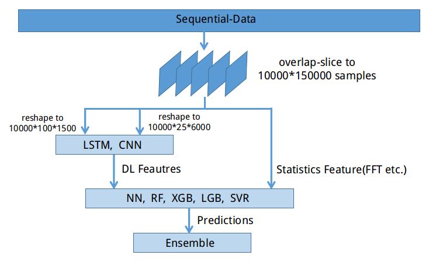

# Kaggle Earthquake Predict

__Competitions:__ [LANL Earthquake Prediction](https://www.kaggle.com/c/LANL-Earthquake-Prediction)  
__Rank:__ 186/4540 (Top 4%, silver)  
__Task:__ Predict earthquake happen time, regression problem  
__Data:__ trainset:length 629145480 signal record, testset:2624 signal record with a length of 150000
__Note:__ This is a code backup, it's not runable due to the difference file path  


## Solution  
1. 将训练集切片成测试集样本大小，通过overlap采样得到10k个样本，作为采样训练集  
2. 将采样训练集reshap成(100,1500)和(25,6000)的片段，放到LSTM和CNN网络里提取DL特征  
3. 提取采样训练集的统计特征（mean,std,min,max,ttf和频段滤波之后的这些特征）  
4. 对统计特征进行随机混合、筛选、过滤(ks_2samp & correlate check)，抽取20个左右的特征（这步是因为train和test分布差异较大，减小过拟合风险）  
5. 将DL特征和过滤后的统计特征组合，形成片段特征向量  
6. 通过NN，RF，SVR，LGB，XGB等方法进行预测  
7. 将预测值ensemble（这里选择stacking，和直接去平均，最终LB得分实际上是直接去平均好）  
  


## File Discribe
```
-------- DL
  |      |
  |      |----- config.py: model config
  |      |
  |      |----- dataset_helper.py: 1.eatract fatures 2.define Dataset & DataLoader
  |      |
  |      |----- models.py: 1.define LSTM & CNN models
  |      |
  |      |----- generate_dl_feature.py: train & extract dl features from DL models
  |      |
  |      |----- dl_utils.py
  |      |
  |       ----- adabound.py: adabound optimizer (not use here)
  |
  |----- Statistics
  |      |
  |      |----- dataset.py: eatract Statistics features
  |      |
  |       ----- feature_importance.py: radnom mix features & filter top values
  |
  |----- global_variable.py: global variable
  |
  |----- generate_kfold.py: generate kfold.pkl
  |
  |----- nn.py: train & inference by NN
  |
  |----- lgb.py: train & inference by LGB
  |
  |----- randomforest.py: train & inference by random-forest
  |
  |----- svr.py: train & inference by svr(SVM in regression)
  |
  |----- xgb.py: train & inference by XGB
  |
  |----- ensemble.py: ensemble predictions by LinearRegress
  |
   ----- utils.py: utils functions


```

## 重难点
这次比赛的主要难点是 __防止过拟合__ 和 __特征工程__   
__过拟合问题：__ 训练集和测试集分布不一致，包括训练集自身不同地震段的分布都不均与（这点可以从不同kfold导致cv差异很大看出）所以防止过拟合尤为重要，为了防止过拟合采用了一下三种手段：  
1. 一般的模型防止过拟合手段，DL加dropout，weight decay， LGB、XGB、RF减小树深和叶子数  
2. 通过ks检验（scipy.stats.ks_2samp），检查特征在训练集和测试集上分布是否相同，筛除分布差异大的  
3. 通过相似度检测（pandas的corr），筛除互相关性高的特征，因为相关性高的特征会产生冗余  
4. 在ensemble时尽可能采取简单的方法，这里试了我采用的是stacking，第二阶段用linearregress，特尝试了直接取平均，很可惜最后提交的是regress的，其实最终得分取平均的会更高，能排到80名  

__特征工程：__ python有一个特征抽取的包tsfresh，再加上scipy里面有一些信号处理的包signal，主要就是一些统计特征比如，min,max,mean,std,波峰波谷数，局部斜率，以及fft，频带滤波，窗口平滑之后的这些特征。在抽取完这些特征之后还做了特征的混合和过滤，最后选取了20个特征值。  

#### Top Rank Solution  
有几个solution比较印象深刻：  
1. 也采用了ks检验，但他不仅用ks检验过滤特诊，还用ks检验过滤训练集，在训练集上抽取与测试集分布相似的子集作为训练集  
2. 因为有数据泄露，所以可以预估测试集的均值，通过把训练集的均值强行拉成测试集的均值，从而达到更好的效果  
3. 加入multitask, 同时预测片段的开始时间，发生时间大于某个阈值的可能性，等等   
4. 大幅度加大cv，第6名用了16fold的cv  